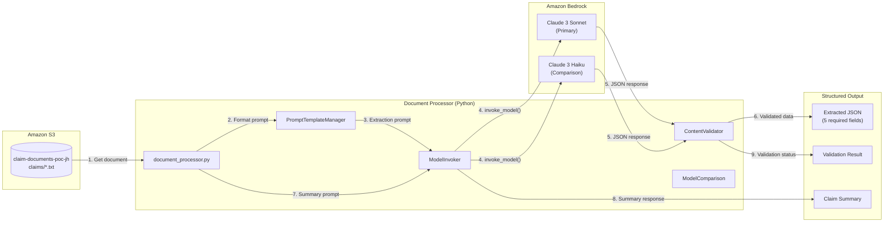

# Architecture Diagram

## Insurance Claim Document Processor - System Architecture

## Data Flow Description

| Step | Component | Action | Input | Output |
|------|-----------|--------|-------|--------|
| 1 | S3 Client | Retrieve claim document | bucket, key | document text |
| 2 | PromptTemplateManager | Format extraction prompt | document text, template | formatted prompt |
| 3 | ModelInvoker | Call Bedrock with retries | prompt, model_id | raw model response |
| 4 | ContentValidator | Parse and validate JSON | response text | structured dict |
| 5 | PromptTemplateManager | Format summary prompt | extracted info, template | formatted prompt |
| 6 | ModelInvoker | Call Bedrock for summary | prompt, model_id | summary text |
| 7 | Document Processor | Assemble final result | all components | result dict |

## Component Responsibilities

### Document Processor (`document_processor.py`)
- Orchestrates the entire processing pipeline
- Manages S3 document retrieval
- Coordinates extraction and summary generation
- Returns unified result dictionary

### Prompt Template Manager (`prompt_templates.py`)
- Stores and manages prompt templates
- Supports template variables and formatting
- Templates: `extract_info`, `generate_summary`, `policy_check`

### Model Invoker (`model_invoker.py`)
- Wraps `bedrock-runtime` `invoke_model` API
- Implements retry logic with exponential backoff
- Handles `ThrottlingException` and `ModelTimeoutException`
- Uses Claude 3 Messages API format

### Content Validator (`content_validator.py`)
- Validates extracted JSON structure
- Checks for 5 required fields
- Parses JSON from model responses (handles surrounding text)
- Returns `ValidationResult` with errors and warnings

### Model Comparison (`model_comparison.py`)
- Compares multiple models on the same document
- Measures latency, output length, extraction completeness
- Provides CLI for running comparisons

## AWS Services Used

| Service | Purpose | Configuration |
|---------|---------|---------------|
| Amazon S3 | Document storage | Bucket: `claim-documents-poc-jh` |
| Amazon Bedrock | Foundation model invocation | Region: us-east-1 |
| Claude 3 Sonnet | Primary extraction & summary | `anthropic.claude-3-sonnet-20240229-v1:0` |
| Claude 3 Haiku | Fast/cheap comparison model | `anthropic.claude-3-haiku-20240307-v1:0` |
